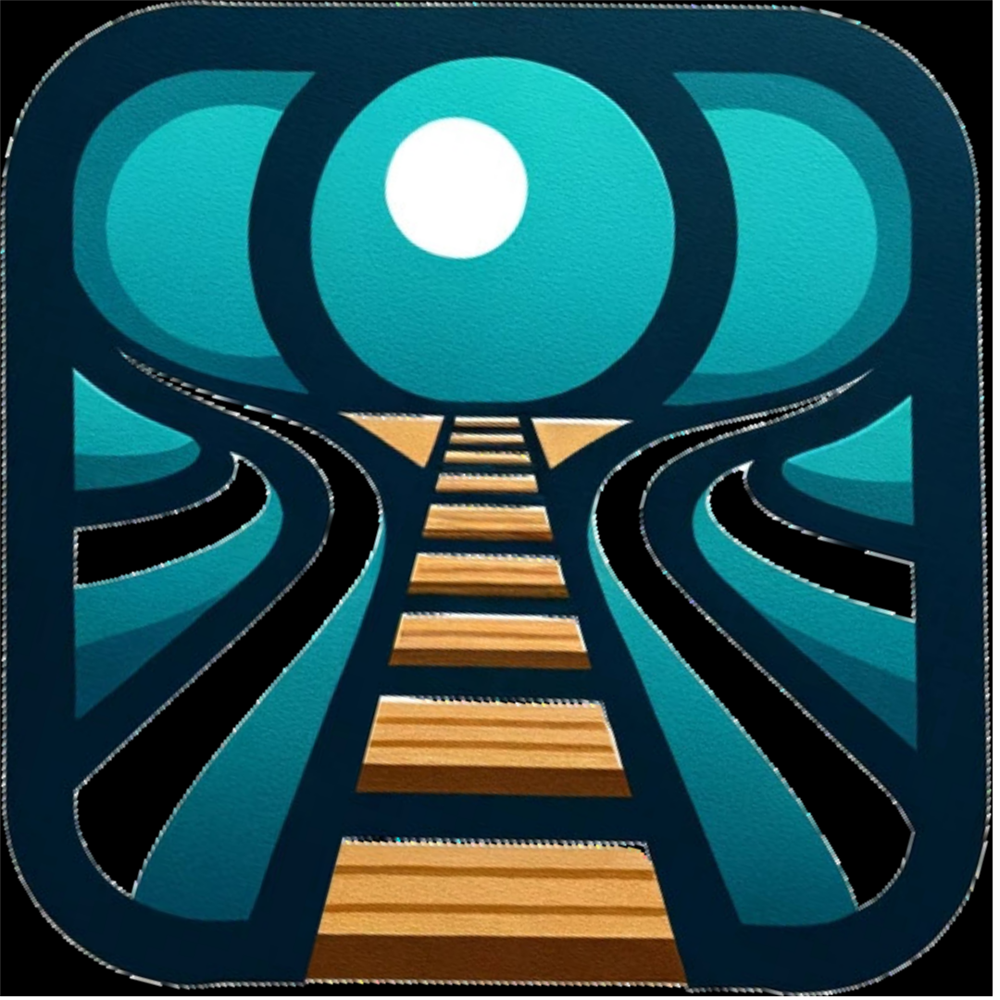
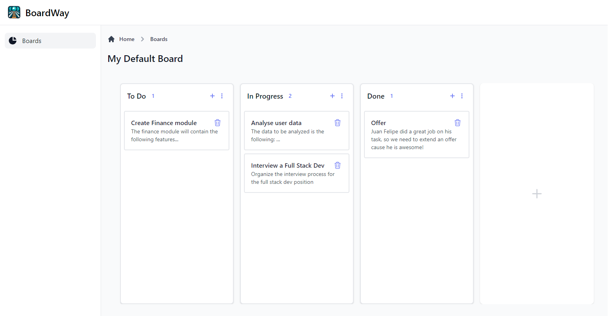

<p align="center"><a href="https://board-way.jjuanrivvera.com" target="_blank"></a></p>

# BoardWay

This application is a simple yet powerful Kanban board, designed to facilitate basic project management capabilities. Built with Laravel 10 and Livewire, it features a dynamic, real-time user experience for managing boards, lists (referred to as rows), and cards without full page reloads.



## Key Features

- **User Authentication**: Secure login and registration system.
- **Kanban Board Management**: Users can create, view, and delete boards.
- **List Management**: Supports multiple lists within a board (e.g., To Do, In Progress, Done), including add, edit, and delete functionalities.
- **Card Management**: Users can add tasks as cards to lists with titles and descriptions, edit them, and move them between lists via drag-and-drop.
- **Real-Time Updates**: Utilizes Livewire for real-time UI updates and interactive components.

## Architecture Overview

The application follows the MVC (Model-View-Controller) architecture, enhanced by Laravel's service and repository patterns for cleaner code organization and separation of concerns.

- **Models**: `Board`, `Row`, and `Card` models represent the application's core entities.
- **Livewire Components**: Separate components for boards, rows, and cards, handling the respective CRUD operations and interactions.
- **Service Layer**: Encapsulates the business logic, making the application more modular and maintainable.
- **Repository Layer**: Abstracts the data access logic from the service layer, simplifying interactions with the database.
- **Events and Listeners**: Utilizes Laravel's event system for real-time broadcasting of updates to boards, rows, and cards.

## Environment Setup with Laravel Sail

Laravel Sail provides a simple command-line interface for interacting with Laravel's default Docker development environment. It requires Docker Desktop to be installed on your system.

### Initial Setup

1. **Clone the repository**:
   ```bash
   git clone https://github.com/jjuanrivvera99/board-way
   cd board-way
   ```

2. **Start Laravel Sail**:
   Laravel Sail is bundled with the application. To start the Docker containers for the application, run:
   ```bash
   ./vendor/bin/sail up
   ```
   If you haven't run `composer install` previously, you might not have the Sail script available. In that case, start Docker containers using Docker Compose directly:
   ```bash
   docker run --rm \
       -u "$(id -u):$(id -g)" \
       -v $(pwd):/opt \
       -w /opt \
       laravelsail/php83-composer:latest \
       composer install --ignore-platform-reqs
   ```
   Then, you can start Sail:
   ```bash
   ./vendor/bin/sail up -d
   ```

3. **Set up your environment**:
   Copy the `.env.example` file to a new file named `.env`, and make sure to set up your database and other environment variables as needed:
   ```bash
   cp .env.example .env
   ```

4. **Generate an application key**:
   ```bash
   ./vendor/bin/sail artisan key:generate
   ```

5. **Run migrations**:
   ```bash
   ./vendor/bin/sail artisan migrate
   ```

6. **Install NPM dependencies and build assets**:
   To manage front-end assets, install NPM dependencies and then run the build process:
   ```bash
   ./vendor/bin/sail npm install
   ./vendor/bin/sail npm run dev
   ```
   This compiles and places your assets within your application's public directory.

### Services Overview

Our Docker setup includes several services essential for a modern Laravel application:

#### `laravel.test` Service

- **Purpose**: Serves the Laravel application using PHP 8.3.
- **Ports**: Exposes the application on `APP_PORT` (default 80) and `VITE_PORT` (default 5173) for HTTP and Vite development server.
- **Volumes**: Maps the project directory to `/var/www/html` inside the container for live code updates.
- **Dependencies**: Relies on `mysql` and `redis` services for database and caching.

#### `queues` Service

- **Purpose**: Manages Laravel's queue workloads.
- **Configuration**: Similar to `laravel.test` but with a specific entrypoint for queue management.

#### `mysql` Service

- **Purpose**: Provides a MySQL database server.
- **Image**: Uses `mysql/mysql-server:8.0`.
- **Ports**: Maps `FORWARD_DB_PORT` to the container's `3306` port.
- **Volumes**: Includes data persistence and initialization script volumes.

#### `redis` Service

- **Purpose**: Offers a Redis server for caching and sessions.
- **Image**: Utilizes `redis:alpine` for a lightweight setup.
- **Ports**: Exposes `FORWARD_REDIS_PORT` for local access.

#### `socketio` Service

- **Purpose**: Handles real-time WebSocket communication.
- **Image**: Utilizes the Dockerfile on docker/socket-io.
- **Ports**: Exposes the WebSocket server port for real-time communication.

### Running the Application

- Access the application by visiting `http://localhost` in your web browser. Laravel Sail maps the application to port 80 by default, but you can configure this in the `docker-compose.yml` file if needed.

### Using Sail for Day-to-Day Commands

Laravel Sail provides a convenient command prefix (`./vendor/bin/sail`) for running Artisan, Composer, NPM, and other command-line tools without requiring you to have these platforms installed on your local machine. For example:

- To run migrations:
  ```bash
  ./vendor/bin/sail artisan migrate
  ```

### Stopping Sail

To stop all of the Docker containers managed by Sail, you can use the `down` command:

```bash
./vendor/bin/sail down
```

## Testing

The application comes with a suite of unit and feature tests. Run the tests using the following command:

```
php artisan test
```

## Documentation

- Inline comments and docblocks are used throughout the application for clarity and maintainability.

## License

This Kanban Board Application is open-sourced software licensed under the [MIT license](LICENSE).
